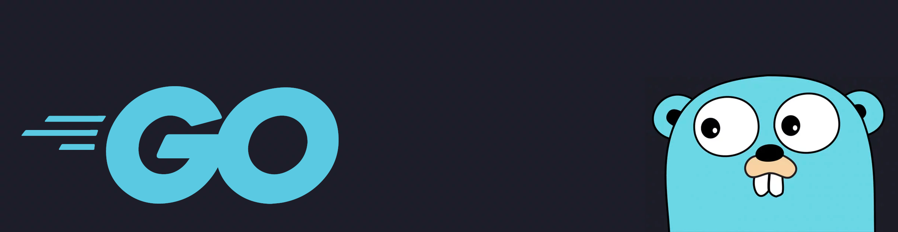

<p align="center">
  
</p>

<p align="center">
  <a href="https://github.com/dunamismax">
    
  </a>
</p>

<p align="center">
  <a href="https://golang.org/"></a>
  <a href="https://github.com/go-chi/chi"></a>
  <a href="https://htmx.org/"></a>
  <a href="https://sqlite.org/"></a>
  <a href="https://opensource.org/licenses/MIT"></a>
</p>

---

## About

Go developer focused on building hypermedia-driven web applications with single-binary deployment. I create comprehensive Go applications emphasizing simplicity, performance, and zero-dependency architectures using modern Go practices.

**Current Focus**: The Ultimate Hypermedia-Driven Web Stack - Go + Chi + HTMX + Gomponents + SQLite + Vanilla CSS + Mage build system.

---

## Featured Project

<p align="center">
  <a href="https://github.com/dunamismax/go-chi">
    
  </a>
</p>

### **[Go-Chi Monorepo](https://github.com/dunamismax/go-chi)** - The Ultimate Hypermedia-Driven Web Stack

A comprehensive monorepo showcasing production-ready Go applications with hypermedia-driven architecture. Demonstrates modern Go practices with single-binary deployment and zero external dependencies.

**Applications**:

- **API Playground** - Interactive API testing platform with text analysis, random generators, and utilities
- **GoSocial** - Twitter-like social media platform with authentication and real-time features
- **Shared Libraries** - Reusable packages for components, database, middleware, styles, and utilities

**Technical Features**:

- **Single-Binary Deployment** with embedded assets via `//go:embed`
- **Hypermedia-First Architecture** using HTMX for dynamic interactions
- **Type-Safe HTML Components** with Gomponents
- **Zero-Latency Database** with embedded SQLite
- **Vanilla CSS** for direct styling control
- **Mage Build System** for Go-based automation
- **Security-Hardened** with input validation and XSS protection

---

## Technical Expertise

<p align="center">
  <a href="https://skillicons.dev">
    
  </a>
</p>

**Core Technologies:**

- **Go 1.23+** with modern syntax and performance optimizations
- **Chi Router** for lightweight, composable HTTP routing
- **HTMX** for dynamic hypermedia interactions
- **Gomponents** for type-safe HTML component generation
- **SQLite** for embedded, zero-latency database operations
- **Vanilla CSS** with embedded asset serving

**Specialized Areas:**

- Hypermedia-driven web application architecture
- Single-binary deployment strategies
- Embedded asset management with Go embed
- Type-safe HTML component development
- Zero-dependency application design
- Go-based build automation with Mage

---

## Development Philosophy

**Simplicity First** → Single-binary applications with minimal external dependencies  
**Performance Focused** → Compiled Go binaries with embedded assets for zero-latency operations  
**Type Safety** → End-to-end type safety from backend logic to frontend components  
**Hypermedia-Driven** → Server-rendered HTML with HTMX for rich interactions  
**Security-Conscious** → Input validation, XSS protection, and secure session management

---

## Quick Start

Explore The Ultimate Hypermedia-Driven Web Stack:

```bash
# Clone the monorepo
git clone https://github.com/dunamismax/go-chi.git
cd go-chi

# Install Mage build system
go install github.com/magefile/mage@latest

# Initialize development environment
mage dev:init

# Start all applications
mage dev:start
# API Playground: http://localhost:8080
# GoSocial: http://localhost:8081

# Build production binaries
mage prod:release
./build/api-playground  # Single binary with all assets
./build/go-social       # Single binary with all assets
```

---

## GitHub Stats

<p align="center">
  
  
</p>

---

## Support My Work

If you find The Ultimate Hypermedia-Driven Web Stack valuable, consider supporting continued development:

<p align="center">
  <a href="https://www.buymeacoffee.com/dunamismax" target="_blank">
    
  </a>
</p>

---

## Connect With Me

<p align="center">
  <a href="https://twitter.com/dunamismax" target="_blank"></a>
  <a href="https://bsky.app/profile/dunamismax.bsky.social" target="_blank"></a>
  <a href="https://reddit.com/user/dunamismax" target="_blank"></a>
  <a href="https://discord.com/users/dunamismax" target="_blank"></a>
  <a href="https://signal.me/#p/+dunamismax.66" target="_blank"></a>
</p>

---

<p align="center">
  <strong>Building the Future with The Ultimate Hypermedia-Driven Web Stack</strong><br>
  <sub>Go + Chi + HTMX + Gomponents + SQLite + Vanilla CSS + Mage</sub>
</p>
